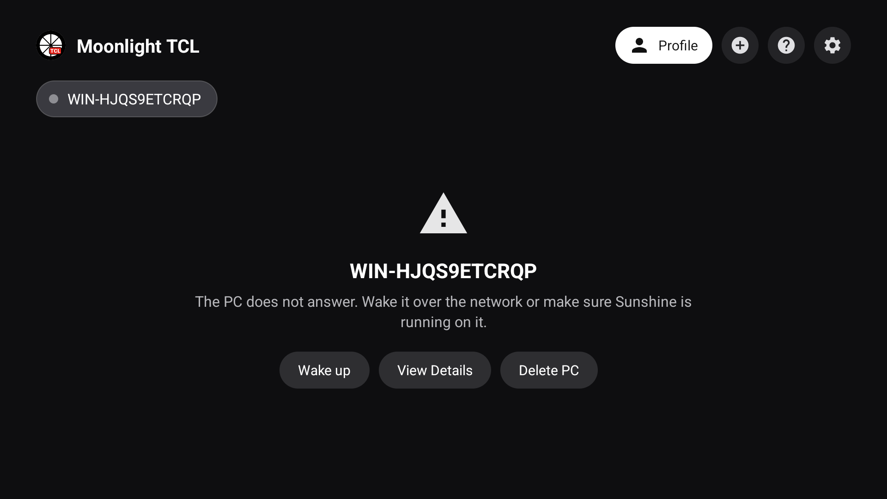
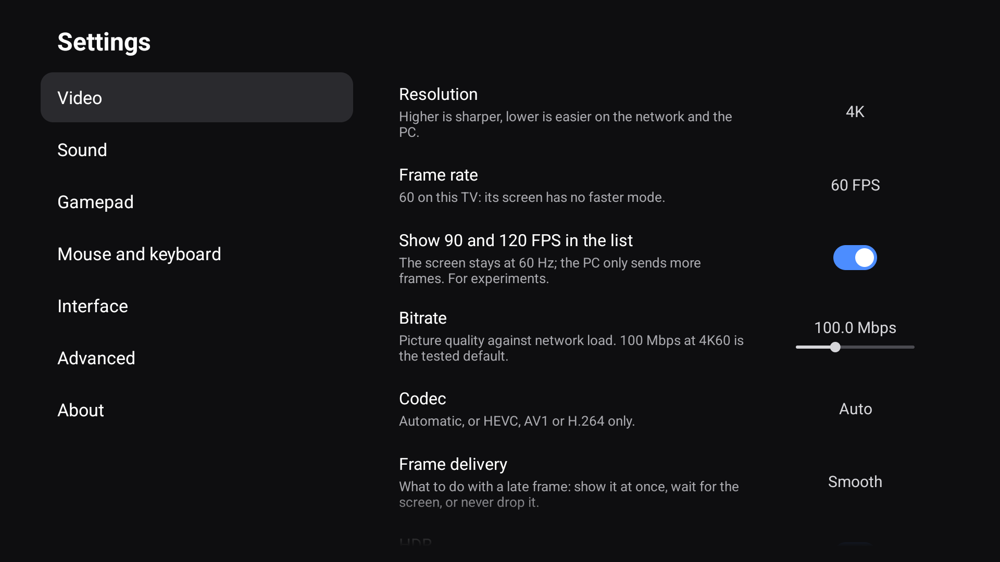
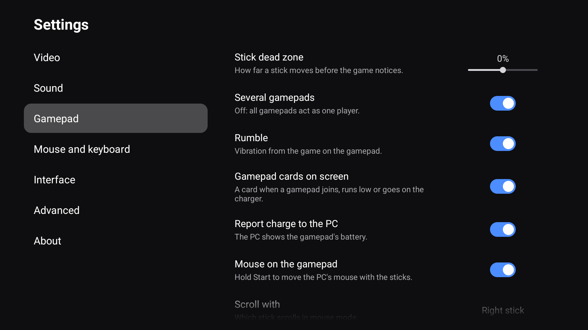
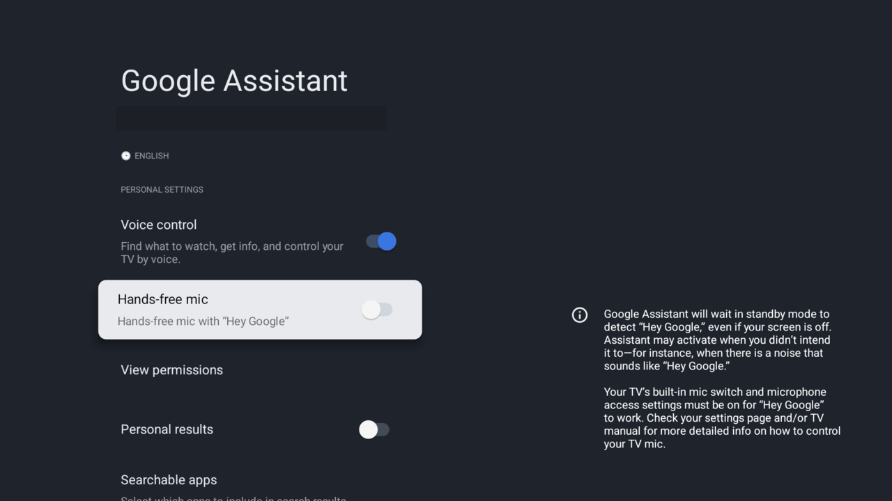
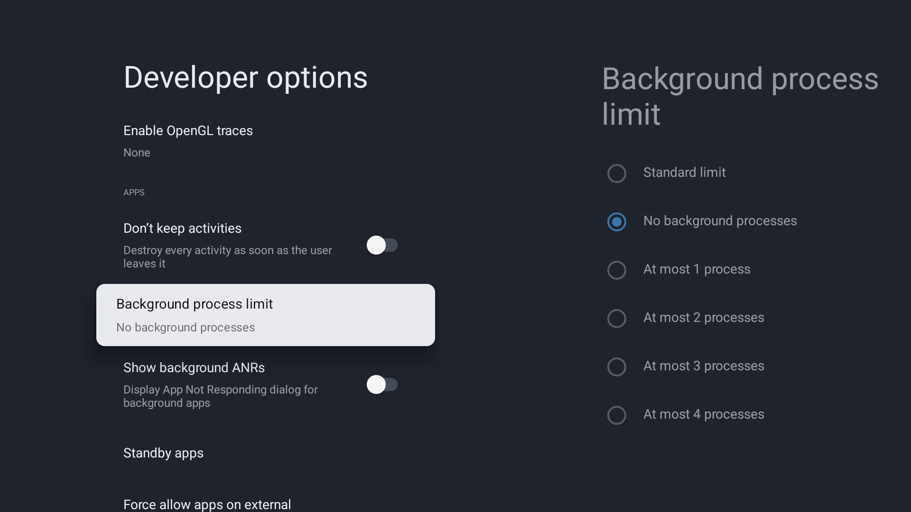

<h1 align="center">Moonlight TCL</h1>

<b>Moonlight for TCL Google TVs on Android 14.</b> 
No freezes, no reboots, no inherited crashes, and the lowest latency the TV's MediaTek chip can deliver: 
4K HDR at a steady 60 frames per second, counted at the screen.

  
  
  
  

  &nbsp;
  &nbsp;
  

  <a href="#why-this-build">Why</a> ·
  <a href="#get-it-running">Install</a> ·
  <a href="#measured-not-promised">Numbers</a> ·
  <a href="#what-is-inside">Features</a> ·
  <a href="#set-up-the-tv">TV setup</a> ·
  <a href="#building">Build</a> ·
  <a href="#по-русски">По-русски</a>

A build of [Artemis](https://github.com/ClassicOldSong/moonlight-android), the Moonlight Android fork, tuned for the MediaTek chip
in **TCL Google TVs on Android 14 firmware** (C8K, C6K, QM6K, QM8K and similar). It streams games and the desktop from
[Sunshine](https://github.com/LizardByte/Sunshine) or [Apollo](https://github.com/ClassicOldSong/Apollo) on your PC. It installs as
its own app (`com.limelight.tcl`) next to Artemis or Moonlight, so their updates never replace it; settings and PC pairings are per
app. Android 14 and `armeabi-v7a` only, because that is what these TVs run. The numbers here were measured on a TCL C8K.
Background: [moonlight-stream/moonlight-android#1533](https://github.com/moonlight-stream/moonlight-android/issues/1533).

<table>
<tr>
<td width="34%"></td>
<td width="33%"></td>
<td width="33%"></td>
</tr>
</table>

## Why this build

<table>
<tr>
<td width="50%" valign="top">
<h3>🛡️ The TV never freezes or reboots</h3>
TCL's Android 14 firmware has a race in its input service that gamepad rumble sets off: the service aborts, the TV shows the boot
animation and every app restarts. Moonlight TCL sends rumble through the Bluetooth stack instead, so the pad shakes and the TV
stays up. The whole-TV freezes of the first builds (volume bar, app switch, stream exit) no longer reproduce; the "volume change
after an hour kills the screen" symptom was that same crash.
</td>
<td width="50%" valign="top">
<h3>🐛 The inherited crashes are fixed</h3>
The Settings screen that crashed on open in Artemis, the crash on oversized frames at high bitrates, and the frame-loss handling
that could drop 120 frames in a row after one lost packet (three fixes from upstream moonlight-common-c) are all gone. The
settings that could not change anything on a TV are gone too: 45 options in seven categories instead of 85 in ten.
</td>
</tr>
<tr>
<td width="50%" valign="top">
<h3>⚡ The shortest path to the panel</h3>
Decoded frames go to the screen straight from the decoder's callback: no renderer thread, no blocking waits, each frame copied
once. Sound leaves through native AAudio. The video threads run at display priority with Android's performance hints, and the
video is the only layer on screen, so the compositor stays on its fast path. The client's own share of the per-frame decode time
is under a millisecond; the rest is the MediaTek hardware decoder.
</td>
<td width="50%" valign="top">
<h3>🎞️ Every frame reaches the screen</h3>
Same TV, same 4K60 HDR stream at 100 Mbps, counted at the TV's compositor: the official Artemis 20.2.6 put all 60 frames on
screen in <b>0 of 48</b> samples, Moonlight TCL in <b>44 of 48</b>, using a third less CPU. Both receive the same 60 frames and
decode them in the same time; the difference is the path between the decoder and the screen.
</td>
</tr>
<tr>
<td width="50%" valign="top">
<h3>🪶 Nothing between you and the stream</h3>
A 2.1 MB APK, all languages included, and 32 MB of RAM on the main screen (Artemis 20.2.6 on the same TV: 12 MB and 81 MB).
No AndroidX, no Material, no OkHttp: every screen is built on the framework's own widgets and the app's own views, the host
is reached through <code>HttpsURLConnection</code>, and most of what is left is the native decoder and streaming library.
One screen before the stream, settings that flip in place, nothing to wait for.
</td>
<td width="50%" valign="top">
<h3>🎮 Made for the TV and the pad</h3>
PCs as chips, apps as posters, a dark action panel on Menu or Y, two-pane settings like the TV's own. An on-screen keyboard
with dictation driven by the gamepad or the remote. A card when a pad joins, runs low or goes on the charger. The interface in
32 languages, right-to-left included.
</td>
</tr>
</table>

## Get it running

1. **Download** the APK from the [latest release](https://github.com/pabragin/moonlight-tcl/releases/latest): one `armeabi-v7a`
   APK per release. For updates, [add Moonlight TCL to Obtainium](https://apps.obtainium.imranr.dev/redirect?r=obtainium://app/%7B%22id%22%3A%22com.limelight.tcl%22%2C%22url%22%3A%22https%3A%2F%2Fgithub.com%2Fpabragin%2Fmoonlight-tcl%22%2C%22author%22%3A%22pabragin%22%2C%22name%22%3A%22Moonlight%20TCL%22%2C%22additionalSettings%22%3A%22%7B%5C%22apkFilterRegEx%5C%22%3A%5C%22armeabi-v7a%5C%22%2C%5C%22matchGroupToUse%5C%22%3A%5C%22%241%5C%22%2C%5C%22versionExtractionRegEx%5C%22%3A%5C%22v(.%2B)%5C%22%7D%22%7D)
   or find it in Obtainium's own "Add app" search: the app is listed in the [Obtainium catalog](https://apps.obtainium.imranr.dev/).
   Inside the app, `Settings → About → Updates via Obtainium` opens Obtainium directly.
2. **Install** with a file manager, the Downloader app or `adb install`. A new version installs over any earlier Moonlight TCL build.
3. **Pair**: open the app, choose your PC, type the PIN into Sunshine or Apollo. Coming from Artemis or Moonlight, pair again:
   pairings and settings are per app.
4. **Play.** The defaults are already set for a 4K TV: 3840×2160, 60 FPS, HEVC, HDR on, 100 Mbps, lowest-latency pacing. When the
   app asks once for the Nearby devices (Bluetooth) permission, say yes: that is what lets rumble reach Bluetooth gamepads.

| | |
|---|---|
| **TV** | TCL Google TV on Android 14 firmware: C8K, C6K, QM6K, QM8K and similar. Android 14 and `armeabi-v7a` only. |
| **PC** | [Sunshine](https://github.com/LizardByte/Sunshine) or [Apollo](https://github.com/ClassicOldSong/Apollo). HDR needs a GPU that encodes HEVC Main 10 and an HDR game. |
| **Network** | Ethernet through a **USB gigabit adapter**. Wi-Fi adds milliseconds of latency and jitter; on Ethernet the hop to the PC is under a millisecond. The TV's own port is 100 Mbps, too small for a 100 Mbps stream. |
| **Gamepad** | Any pad the TV sees. Rumble over Bluetooth is verified on Xbox pads; a pad on a USB cable goes through Moonlight's own USB driver. |

> [!IMPORTANT]
> **Does the TV still freeze or go black when you leave the stream? Turn on `Settings → Advanced → Keep a second layer above the
> video (only if the TV freezes)`.** It keeps a tiny transparent surface above the video and removes the video before the stream
> screen closes, so the firmware never has to rebuild the picture under a playing video. It costs 10–15 ms of display latency.
>
> **Video above 1080p corrupted** (wrong crop, shifted image, green and blue bands at 4K)? **Turn off `Settings → Advanced → TV
> game mode (recommended)`.** This happens on TCL TVs with a Realtek SoC, such as the Brazilian C6K.

If the TV still freezes or reboots, open an issue with `adb logcat -v threadtime -b all` captured around the moment, or after a
reboot the output of `adb shell dumpsys dropbox --print system_server_native_crash`.

## Measured, not promised

Everything below is from a TCL C8K, firmware V655, HEVC, 60 FPS, wired gigabit network, on a rested TV (why that matters is
explained under the tables). The one game figure that was not measured under controlled conditions is marked as such.

### Against the official Artemis 20.2.6

Artemis 20.2.6 is the release this fork started from. Same TV, same PC, same settings: 4K60 HEVC HDR, 100 Mbps, lowest-latency
pacing. The source is [`tools/framerate-test.html`](tools/framerate-test.html) in heavy mode on the PC, a page guaranteed to
deliver 60 frames per second; the TV's compositor was asked every two seconds how many frames it had actually put on the screen.

| Test page in heavy mode, 4K60 HDR, 100 Mbps | Artemis 20.2.6 | Moonlight TCL |
|---|---|---|
| Samples with all 60 frames per second on screen | **0 of 48**, every sample 50–56 | **44 of 48**, the rest 57–59 |
| Frames per second arriving from the network | 60 | 60 |
| Decoder time per frame | 14–15 ms | 14–15 ms |
| App CPU load (4 cores) | 54–62 % | 38–41 % |

At 200 Mbps, where the decoder itself is the limit for both, an earlier run gave 5 of 22 samples at 60 for Artemis against 10 of
22 here. In a game at 100 Mbps the gap was larger, 40–51 frames per second on screen for Artemis against a steady 60 here while
spinning the camera in a heavy scene, but the PC's own frame rate was not recorded in those runs, so take that pair as indicative
only. Two more differences need no measurement: Artemis sends rumble through the system input stack, the path that reboots this
TV, and its Settings screen crashed on open during the test.

How the comparison was run

For this run the Artemis 20.2.6 source was built as the same package as Moonlight TCL (then 20.2.10-tcl3), so both clients
shared one pairing and one settings file; they were installed over each other and measured back to back, twice each, on the
same host session. The test page's own counter read 60.0 throughout. Each two-second answer from the compositor was scored as
either "all 60 per second" or "fewer". The performance overlay was off in both clients: drawing it costs the compositor about
25 ms per frame and ruins the measurement.

### Decode time by resolution

The client's own share of the per-frame decode time is under a millisecond; the rest is the MediaTek hardware decoder, and what it
costs depends on pixels and bitrate, not on the codec.

| Stream | Decode time per frame |
|---|---|
| 3840×2160 HDR, 100 Mbps | 13 ms |
| 3840×2160 H.264, 100 Mbps | 14–15 ms (no better than HEVC) |
| 2560×1440, 100 Mbps | 7 ms |
| 1920×1080, 100 Mbps | 6 ms |

### 4K60 HDR by bitrate

Frames that actually reach the screen while spinning the camera in a heavy scene, counted at the compositor:

| Bitrate | Decode time | Frames/s on screen |
|---|---|---|
| 60 Mbps | 12 ms | 60 |
| 100 Mbps | 13 ms | 58–60, an occasional single dropped frame |
| 120 Mbps | 14 ms | 60 in some scenes, about 40 in the heaviest |

### Which bitrate to set

| You want | Set | What you get |
|---|---|---|
| The default | **100 Mbps** | A picture essentially transparent for a real-time encoder; 60 frames per second in nearly every scene. |
| Smoothness in every scene | 60 Mbps | 60 frames per second everywhere, a slightly softer picture. Anything in between behaves accordingly. |
| The last bit of detail | 120 Mbps | Dark HDR scenes at their best; dips to about 40 frames per second in the heaviest moments, the decoder has no headroom left. |
| Latency over sharpness | 2560×1440 | 7 ms of decode instead of 13; the TV scales it to the panel. Stay on HEVC. |

### Footprint

Both apps installed on the same TV and opened to their main screen, no stream running (`dumpsys meminfo`, proportional set size).

| | Moonlight TCL | Artemis 20.2.6 |
|---|---|---|
| APK | **2.1 MB**, `armeabi-v7a`, all 32 languages | 12.1 MB, universal |
| On the TV's storage | **2 MB** (plus the box art cached for your PCs) | 14 MB |
| RAM on the main screen | **32 MB** | 81 MB |
| of which the Java heap | 2.5 MB | 42 MB |
| of which code | 3.8 MB | 10 MB |

What else moves the numbers: heat, background apps, and things that turned out not to matter

**Heat.** After about an hour of continuous 4K HDR the decoder on this TV started returning 45–50 frames per second with either
client while still receiving 60, and fifteen minutes of idle brought it back to 60. All figures here are from a rested TV.

**Background load.** What else runs on the TV matters as much as the client. In one session the frames on screen came in waves,
about 40 per second for 20 seconds every 90 seconds, while 60 kept arriving from the network and the socket dropped nothing:
Google Assistant's hands-free "Hey Google" detection was using a quarter of a core the whole time, a browser and the TV settings
sat in memory, the kernel was stalling on memory reclaim 250 times a second and the SoC ran at 78–80 °C. With hands-free
detection switched off and the background apps closed, the same stream held 60 in 86 % of samples instead of 48 %, and the
SoC ran two degrees cooler. See [Set up the TV](#set-up-the-tv).

**Things that did not matter on this TV.** The display has exactly one mode, 3840×2160 at 60 Hz (the panel's 120/144 Hz exist
only for HDMI inputs), so a 120 FPS stream is shown at 60. Releasing frames with a zero timestamp made no difference to
smoothness or latency. Of the MediaTek decoder's ~113 vendor keys, the latency-named ones were tried one at a time and none
helped (some are ignored, one blanks the screen, `game-mode` leaves the decode time unchanged and visibly smears the picture),
so none are used.

## What is inside

<b>Stability</b>: what was fixed and what is left out

- The whole-TV freezes of the first builds (volume bar, app switch, stream exit) do not reproduce on firmware V655 and later. For
  TVs where the exit freeze still happens, `Settings → Advanced → Keep a second layer above the video` keeps a 2×2 px surface above
  the video and removes the video layer before leaving the stream, at 10–15 ms of display latency. The "volume change after an
  hour freezes the screen and the app dies" symptom was the rumble crash all along.
- Fixed a Settings-screen crash inherited from Artemis and a crash on oversized frames at high bitrates.
- Frame-loss recovery as in upstream Moonlight since September 2026: no speculative loss reports while reference-frame
  invalidation is off (one lost packet could drop up to 120 consecutive frames), a partially dropped IDR frame is handled
  correctly, and invalidation after a multi-block loss points at the right frames.
- Phone-only features and the 3D mode are gone, logcat is quiet during a stream, and the settings are down to the ones that can
  change something on a TV: no touchpad, metered-network, clipboard, floating-button, in-app-language or community-logging
  options, every title and description rewritten in one plain line.

<b>Video</b>: the proven renderer, straight from the decoder to the screen

- The proven renderer from before Artemis' August 2025 experiments (polling loop, codec-flushing watchdog, undocumented MediaTek
  keys, forced Balanced pacing), which had made controller response noticeably slower on TCL.
- Decoded frames go to the screen straight from the decoder's callback: no renderer thread in between and no blocking waits.
- Each frame is copied once, from the network buffers directly into the decoder's input buffer, instead of twice through Java.
- The decoder is always asked for every low-latency option it accepts; the video threads run at display priority and are
  registered with Android's performance hints (ADPF); the app is declared a game.
- The video is the only layer on screen, which keeps the TV's compositor on its fast path.
- Defaults for a 4K TV: 3840×2160, 60 FPS, 100 Mbps, HEVC, HDR on, lowest-latency pacing.

<b>Audio</b>: native AAudio

- Native AAudio low-latency output, no Java between the decoder and the audio driver. Falls back to `AudioTrack` on its own,
  and when the system equalizer is on.

<b>Rumble</b>: through the Bluetooth stack, not the input service that restarts the TV

- TCL's Android 14 firmware has a race in `system_server`'s input service: a gamepad vibration arrives on a binder thread and is
  pushed into the event queue that the input reader thread is draining without the lock. Any rumble sent through the Android
  input stack can hit it; when it does, the system service aborts, the TV shows the boot animation and every app restarts, which
  looks exactly like a reboot (confirmed from the crash dumps and AOSP source; fixed upstream in Android 15, so only TCL can fix
  it here).
- Moonlight TCL therefore sends rumble to Bluetooth gamepads through the Bluetooth stack's own HID host: the output report
  reaches the pad by the same Bluetooth path the kernel's force feedback would take, but `system_server` and its input reader
  are never involved. It needs the Nearby devices (Bluetooth) permission, which the app asks for once. Rumble is **on** by default.
- Xbox pads are verified on the TV; DualShock 4, DualSense, Switch Pro and Joy-Con, 8BitDo, Amazon Luna, Google Stadia, NVIDIA
  Shield 2017 and GameSir 8K pads are written from the Linux and SDL driver sources and still wait for someone with the hardware
  (an issue saying whether yours rumbles would settle it). Other Bluetooth pads stay silent on this TV: there is no switch back
  to the input service, because that path is what restarts the TV. A gamepad on a USB cable is driven by Moonlight's own USB
  driver and never touches the input stack either.

<b>Gamepads on screen</b>: cards and charge

- A card over the stream when a gamepad joins, when its battery runs low (20 %, then 10 %) and when it goes on the charger:
  player number, the pad's name as set in the TV's Bluetooth settings, the charge. Player 1 bottom-left, player 2 bottom-right;
  while the in-game menu is open every pad's charge stays in the corners, and the PC and app lists show the attached pads as
  small icons with a battery at the top right.
- The TV exposes no gamepad battery itself, so the pad is asked over Bluetooth LE (the standard Battery Service); the Xbox
  Wireless Controller has no charging flag anywhere, but a counter in its statistics table grows at every cable plug-in, and
  that is where the charger card comes from. The pad never reports the cable coming out, so the state returns to discharging
  once the level falls. `Settings → Gamepad → Gamepad cards on screen` turns it off.

<b>On-screen keyboard</b>: typing and dictation from the pad or the remote

- `Game menu → On-screen keyboard` draws a keyboard over the stream and hands the gamepad to it: d-pad or left stick moves,
  A presses, B closes, X is Backspace, Y is Space, LB/RB switch between the US, Russian and function-key pages, LT is Shift,
  RT is Enter; the TV remote works the same way with OK and Back.
- Latin letters, digits and the special keys reach the PC as real key presses, like a US keyboard plugged into it, so games and
  shortcuts see them and the PC's own layout decides the character; Russian letters go as text and come out right whatever
  layout the PC is in.
- Shift, Ctrl and Alt are sticky (tap for the next key, tap again to lock), Win opens the Start menu, and the Fn page has
  F1–F12, Ins/Del/Home/End/PgUp/PgDn, PrtSc and ready shortcuts: Alt+Tab, Alt+F4, Win+D, Win+R, Win+Tab, Win+E, Ctrl+C/V/Z/A.
- The microphone key (or the View button) dictates through the TV's speech recognizer: Russian on the Russian page, the TV's
  language otherwise; the text lands on the PC as typed text, and the first use asks for the microphone permission. The TV's
  own keyboard is not used: it needs a text field and never sees gamepad buttons.

<b>Interface</b>: one screen, two-pane settings, 32 languages

- One screen before the stream, in the style of the TV's own menus: the PCs as chips in the header with a status dot (green
  online, grey offline, a lock when not paired), the selected PC's apps as posters below, the attached gamepads with their
  charge in the corner, the active settings profile and the settings behind pill buttons. A PC that is offline, unpaired or
  still being checked shows a short message with the actions that make sense (wake, pair, delete) instead of the grid. Long
  press, Menu or the gamepad's Y open the dark action panel for a PC or an app.
- Settings are two-pane like the TV's: categories on the left, the rows on the right, toggles flip in place, choices open the
  panel, sliders and text values a small dialog; a settings profile is edited on the same screen with the changed rows marked.
  Left and Back return to the categories.
- "Go to Server Config" opens the Sunshine or Apollo web UI in the in-app browser: the PC's own certificate is accepted, the
  login is asked for, and Back closes the page.
- The interface comes in 32 languages (English, Russian, Ukrainian, Polish, Czech, Bulgarian, German, Dutch, Danish, Swedish,
  Norwegian, Finnish, French, Spanish, Italian, Portuguese and Brazilian Portuguese, Romanian, Greek, Turkish, Hungarian,
  Hebrew, Arabic, Persian, Hindi, Thai, Vietnamese, Indonesian, Japanese, Korean, Simplified and Traditional Chinese), every
  one complete, right-to-left layouts for Arabic, Hebrew and Persian; the app follows the TV's language or the per-app language
  picked in Android settings.
- No AndroidX and no OkHttp: every screen is built on the framework's widgets (Activity, ListView, GridView, AlertDialog) and the
  app's own Views, the host is reached through `HttpsURLConnection`. The APK is 2.1 MB with all languages (37 MB in the first
  builds); most of what is left is the native decoder and streaming library.

<b>Tools</b>: built-in latency test, frame rate test page

- **Built-in latency test** (`Settings → Advanced → Latency test mode`): open [`tools/latency-test.html`](tools/latency-test.html)
  full screen on the PC, press A/B/X/Y in the stream, read button-to-frame latency split into input, host+network and
  decode+present.
- **Latency report after the stream** (`Settings → Interface`) shows the decode time of the session.
- [`tools/framerate-test.html`](tools/framerate-test.html) is a local 60 fps test pattern for the PC (ladder, moving bar, frame
  counter, heavy mode): every dropped or duplicated frame in the stream is visible on the TV without any overlay.

## Set up the TV

The TV's own background work costs frames and heat (see [Measured, not promised](#measured-not-promised)). On a TCL C8K these
settings are worth a look; the screenshots are from firmware V655 with the menu switched to English.

**Plug in Ethernet through a USB adapter.** Wi-Fi latency is far too high for this: every hop costs milliseconds and jitters,
and the jitter is what drops frames. On Ethernet the TV reaches the PC in under a millisecond. The TV's built-in port is only
100 Mbps, which does not carry a 100 Mbps stream with its audio and overhead; a USB gigabit Ethernet adapter does. The TV
picks it up without drivers and the link negotiates 1000 Mbps. All the numbers in this README were measured on such a link.

**Turn off hands-free "Hey Google".** Settings → Accounts & Profiles → your account → Google Assistant → *Hands-free mic* off.
With it on, the Assistant's hotword detector used a quarter of a CPU core the whole time the TV was on. The microphone button on
the remote keeps working.

**Close what you are not using.** The TV has 2.4 GB of RAM and swaps to compressed memory; a browser left in the background plus
the TV settings screen pushed the kernel into reclaiming memory 250 times a second during a stream. Quit them before streaming
(Settings → Apps → the app → Force stop).

**Developer options, if you have them enabled.** Make sure *Don't keep activities* is off. It is a debugging aid, not a memory
saver: it frees nothing (the process and its heap stay) and only destroys the screen you leave, so every return rebuilds it
from scratch; in Moonlight TCL that means polling the PCs and loading the posters again after every trip to Settings or a
stream. Memory is freed by *Background process limit* → "No background processes" or "At most 2 processes", which keeps idle
apps out of memory at the price of other apps restarting more often. Nothing else in there helps streaming.

**Keep it cool.** After an hour of 4K HDR the SoC sits at 76–82 °C and the firmware trims the decoder. Lower panel brightness
changed that by about a degree; airflow behind the TV matters more.

## Building

- JDK 17 and the Android SDK with NDK `27.3.13750724` (see `app/build.gradle`).
- `git submodule update --init --recursive` (`moonlight-common-c` comes from
  [pabragin/moonlight-common-c](https://github.com/pabragin/moonlight-common-c), branch `tcl`).
- Point Gradle at the SDK with `ANDROID_HOME` or `local.properties`.
- `./gradlew :app:assembleRelease` (not `-Pandroid.injected.build.abi`: it marks the APK `testOnly`, which the TV rejects), then
  `zipalign` and `apksigner sign` the APK from `app/build/outputs/apk/release/` with your own keystore.

## Credits and license

All streaming functionality is the work of the Moonlight and Artemis authors:
[Cameron Gutman](https://github.com/cgutman), [Diego Waxemberg](https://github.com/dwaxemberg), [Aaron Neyer](https://github.com/Aaronneyer),
[Andrew Hennessy](https://github.com/yetanothername), [ClassicOldSong](https://github.com/ClassicOldSong) and the contributors of both
projects. Moonlight started as a project of students at [Case Western](http://case.edu) at [MHacks](http://mhacks.org).

Licensed under the GNU GPL v3, see [LICENSE.txt](LICENSE.txt).

---

## По-русски

  &nbsp;
  &nbsp;
  

Сборка [Artemis](https://github.com/ClassicOldSong/moonlight-android) для телевизоров TCL на прошивке Android 14 (C8K, C6K, QM6K,
QM8K и похожие): без зависаний и перезагрузок телевизора, без унаследованных крашей и с минимальной задержкой, которую может дать
чип MediaTek. Стримит игры и рабочий стол с [Sunshine](https://github.com/LizardByte/Sunshine) или
[Apollo](https://github.com/ClassicOldSong/Apollo) на ПК. Приложение называется Moonlight TCL, пакет `com.limelight.tcl`, ставится
рядом с обычным Artemis или Moonlight и не затирается их обновлениями; только Android 14 и `armeabi-v7a`, потому что на этих
телевизорах другого нет. APK на странице [Releases](https://github.com/pabragin/moonlight-tcl/releases), обновления через
Obtainium (приложение есть в его каталоге, а в самом приложении «Настройки → О программе → Обновления через Obtainium» открывает
Obtainium напрямую). После установки спарьтесь с ПК заново: настройки и пары у каждого приложения свои. Все цифры сняты на TCL C8K.

**Почему эта сборка**

- **Телевизор не зависает и не перезагружается.** В прошивке Android 14 у системной службы ввода есть гонка, которую запускает
  вибрация геймпада через системный стек: служба падает, телевизор показывает анимацию загрузки, и все приложения
  перезапускаются (исправлено только в Android 15). Здесь вибрация идёт в обход: Bluetooth-геймпадам она отправляется через
  собственный HID-хост Bluetooth-стека, по USB-кабелю через собственный драйвер Moonlight. Зависания всего телевизора из первых
  сборок (полоса громкости, переключение приложений, выход из стрима) больше не воспроизводятся, а «через час меняешь громкость и
  экран гаснет» было тем же самым падением.
- **Унаследованные краши исправлены.** Экран настроек, который в Artemis падал при открытии; падение на слишком больших кадрах
  при высоком битрейте; обработка потерь, из-за которой один потерянный пакет мог отбросить 120 кадров подряд (три исправления
  из апстримного moonlight-common-c).
- **Кратчайший путь до панели.** Кадры уходят на экран прямо из колбэка декодера, без промежуточного потока и блокировок; кадр
  копируется один раз; декодеру всегда выставляются все опции низкой задержки; потоки видео с приоритетом экрана и подсказками
  производительности Android; звук через нативный AAudio; видео единственный слой на экране, так что композитор идёт быстрым
  путём. Собственная доля клиента в декодировании кадра меньше миллисекунды, остальное аппаратный декодер MediaTek.
- **Все 60 кадров доходят до экрана.** Тот же телевизор, тот же стрим 4K60 HDR на 100 Мбит/с: у официального Artemis 20.2.6 все
  60 кадров дошли до экрана в 0 из 48 замеров, здесь в 44 из 48, при загрузке процессора на треть меньше.
- **Ничего лишнего.** APK 2,1 МБ со всеми языками против 12 МБ у Artemis 20.2.6, на телевизоре 2 МБ против 14, в памяти на
  главном экране 32 МБ против 81 (Java-куча 2,5 МБ против 42; оба замера на одном телевизоре, без стрима). Без AndroidX,
  Material и OkHttp: все экраны на виджетах самой системы и собственных View, хост опрашивается через HttpsURLConnection,
  большая часть размера это нативная библиотека декодера и стриминга. Настроек 45 в семи категориях вместо 85 в десяти:
  остались только те, что вообще могут что-то изменить на телевизоре.
- **Сделано для телевизора и геймпада.** Один экран перед стримом, двухпанельные настройки, экранная клавиатура с диктовкой,
  карточки геймпадов, интерфейс на 32 языках.

**Что внутри**

- **Интерфейс.** Один экран в стиле меню самого телевизора: ПК чипами в шапке с точкой статуса (зелёная в сети, серая не в
  сети, замок без сопряжения), под ними постеры приложений выбранного ПК, в углу подключённые геймпады с зарядом, профиль и
  настройки за круглыми кнопками. ПК не в сети, без сопряжения или ещё проверяемый показывает вместо сетки короткое сообщение и
  уместные действия (разбудить, сопрячь, удалить). Долгое нажатие, Menu или Y на геймпаде открывают тёмную панель действий для
  ПК или приложения. Настройки двухпанельные, как у телевизора: категории слева, пункты справа, переключатели щёлкают на месте,
  выбор значений открывает панель, ползунки и текст — небольшой диалог; профиль настроек редактируется на том же экране с
  пометкой изменённых пунктов. «Открыть настройки сервера» показывает веб-интерфейс Sunshine или Apollo во встроенном браузере:
  сертификат ПК принимается, запрашивается логин, «назад» закрывает страницу. Интерфейс переведён на 32 языка полностью, для
  арабского, иврита и фарси раскладка справа налево; приложение берёт язык телевизора или тот, что выбран для него в настройках
  Android.
- **Вибрация.** Включена по умолчанию, нужно разрешение «Устройства поблизости», которое приложение спрашивает один раз. Xbox
  проверен на телевизоре; DualShock 4, DualSense, Switch Pro, Joy-Con, 8BitDo, Amazon Luna, Google Stadia, NVIDIA Shield 2017 и
  GameSir 8K сделаны по исходникам драйверов Linux и SDL и ждут проверки на живых геймпадах; остальные Bluetooth-геймпады на этом
  телевизоре не вибрируют, обратного переключения на системную службу нет, потому что именно она перезагружает телевизор.
- **Карточки геймпадов.** При подключении, при низком заряде (20 %, потом 10 %) и при подключении кабеля показываются номер
  игрока, имя из Bluetooth-настроек телевизора и заряд (игрок 1 слева внизу, игрок 2 справа); пока открыто меню игры, заряд всех
  геймпадов стоит по углам, а в списках ПК и приложений подключённые геймпады показаны маленькими значками с батарейкой. Сам
  телевизор заряд не отдаёт, поэтому уровень читается у геймпада по Bluetooth LE, а кабель у Xbox определяется по счётчику
  подключений в его таблице статистики. Выключается в «Настройки → Геймпад → Карточки геймпадов».
- **Экранная клавиатура.** Из меню игры: крестовина или левый стик двигают курсор, A нажимает, B закрывает, X — Backspace,
  Y — пробел, LB/RB переключают латиницу, кириллицу и страницу функциональных клавиш, LT — Shift, RT — Enter; с пульта так же.
  Латиница, цифры и служебные клавиши уходят на ПК как нажатия настоящей US-клавиатуры (символ определяет раскладка ПК, игры и
  сочетания работают), русские буквы — как текст, независимо от раскладки ПК. Shift, Ctrl и Alt залипающие, Win открывает меню
  «Пуск», на странице Fn есть F1–F12, Ins/Del/Home/End/PgUp/PgDn, PrtSc и готовые сочетания Alt+Tab, Alt+F4, Win+D, Win+R,
  Win+Tab, Win+E, Ctrl+C/V/Z/A. Клавиша с микрофоном (или кнопка View) включает голосовой набор через распознавание речи самого
  телевизора: по-русски на русской раскладке, на языке телевизора на остальных; текст приходит на ПК как набранный, при первом
  использовании спрашивается доступ к микрофону.
- **Инструменты.** Встроенный тест задержки («Настройки → Дополнительно → Режим теста задержки» плюс `tools/latency-test.html`
  на ПК), отчёт о задержке после стрима («Настройки → Интерфейс»), тестовая страница `tools/framerate-test.html` с 60 кадрами в
  секунду, на которой каждый пропущенный или задвоенный кадр виден без оверлея.

**Сравнение с официальным Artemis 20.2.6** на том же телевизоре при одинаковых настройках 4K60 HDR, 100 Мбит/с. Исходники
Artemis собраны как тот же пакет, поэтому у обоих клиентов одна пара с ПК и один файл настроек; они ставились друг поверх друга
и мерялись подряд, по два раза каждый, в одной сессии хоста. Источник — `tools/framerate-test.html` в тяжёлом режиме, страница,
которая гарантированно выдаёт 60 кадров в секунду; композитор телевизора каждые две секунды опрашивался, сколько кадров он
реально вывел; оверлей статистики у обоих выключен, его отрисовка стоит композитору около 25 мс на кадр.

| Тестовая страница, тяжёлый режим, 100 Мбит/с | Artemis 20.2.6 | Moonlight TCL |
|---|---|---|
| Замеров, где все 60 кадров в секунду дошли до экрана | **0 из 48**, везде 50–56 | **44 из 48**, остальные 57–59 |
| Кадров в секунду из сети | 60 | 60 |
| Время декодера на кадр | 14–15 мс | 14–15 мс |
| Загрузка процессора (4 ядра) | 54–62 % | 38–41 % |

При 200 Мбит/с, когда оба упираются в декодер, в более раннем прогоне 5 из 22 против 10 из 22. В игре разрыв был больше, 40–51
кадр против ровных 60, но частота хоста там не записывалась, так что это только ориентир. Вибрация у Artemis идёт через
системный стек, который перезагружает этот телевизор, а его экран настроек во время теста упал при открытии.

**Что ещё влияет на цифры.** Примерно через час непрерывного 4K HDR декодер этого телевизора начал выдавать 45–50 кадров в
секунду с любым клиентом, а после пятнадцати минут простоя вернулся к 60; все цифры сняты на отдохнувшем телевизоре. Фоновая
нагрузка телевизора влияет не меньше клиента: в одной сессии кадры на экране шли волнами, около 40 в секунду по 20 секунд каждые
полторы минуты, хотя из сети приходили все 60 и сокет ничего не терял. Причина: Google Assistant с распознаванием «Окей, Google»
без пульта постоянно занимал четверть ядра, в памяти сидели браузер и настройки телевизора, ядро 250 раз в секунду
останавливалось на освобождение памяти, SoC 78–80 °C. После отключения голосового управления без пульта и закрытия фоновых
приложений тот же стрим держал 60 кадров в 86 % замеров вместо 48 %, а SoC стал на два градуса холоднее.

**Какой битрейт ставить для 4K60 HDR**

| Нужно | Ставьте | Что получите |
|---|---|---|
| По умолчанию | **100 Мбит/с** | Картинка практически без потерь, 60 кадров держатся почти во всех сценах. |
| Плавность в любой сцене | 60 Мбит/с | 60 кадров везде, картинка чуть мягче. |
| Максимум деталей | 120 Мбит/с | Тёмные HDR-сцены во всей красе, просадки до 40 кадров в самых тяжёлых моментах: запаса у декодера нет. |
| Задержка важнее чёткости | 2560×1440 | Декодирование 7 мс вместо 13, до панели телевизор масштабирует сам. Оставайтесь на HEVC. |

**Настройки телевизора.** Сначала сеть: подключить телевизор по кабелю через USB-адаптер Ethernet. По Wi-Fi задержка слишком
велика, каждый переход стоит миллисекунд и плавает, а именно джиттер роняет кадры; по кабелю до ПК меньше миллисекунды.
Встроенный порт телевизора только 100 Мбит/с, стрим на 100 Мбит/с со звуком и служебным трафиком в него не влезает, а
USB-адаптер на гигабит телевизор подхватывает без драйверов и поднимает линк на 1000 Мбит/с; все цифры в этом README сняты на
таком подключении. Дальше фон телевизора, он стоит кадров и градусов, поэтому: отключить голосовое управление без пульта
(Настройки → Аккаунты и вход → аккаунт → Google Assistant → «Микрофон без рук» выкл.; кнопка микрофона на пульте продолжит
работать); закрывать перед стримом браузер и другие фоновые приложения
(Настройки → Приложения → приложение → Остановить); в параметрах разработчика, если они включены, убедиться, что «Не сохранять
действия» выключено: это отладочная опция, памяти она не освобождает (процесс и его куча остаются), а только уничтожает экран,
с которого ушли, и каждое возвращение собирает его заново с повторным опросом ПК и постеров; память освобождает «Лимит фоновых
процессов», при желании «Без фоновых процессов» или «Не более 2»; и дать
телевизору воздух сзади: после часа 4K HDR SoC держится на 76–82 °C, и прошивка сама режет декодер, а яркость панели меняет это
всего на градус. Скриншоты меню на английском лежат в `docs/tv/`.

> [!IMPORTANT]
> **Телевизор всё ещё зависает или гаснет при выходе из стрима? Включите `Настройки → Дополнительно → Второй слой поверх видео
> (только при зависаниях)`.** Над видео держится крошечная прозрачная поверхность, а при выходе видео убирается до закрытия экрана
> стрима, и прошивке не приходится перестраивать картинку под идущим видео. Цена — 10–15 мс задержки картинки.
>
> **Видео выше 1080p искажено** (неверная обрезка, сдвинутая картинка, зелёные и синие полосы в 4K)? **Выключите `Настройки →
> Дополнительно → Игровой режим телевизора (рекомендуется)`.** Так бывает на TCL с процессором Realtek, например бразильском C6K.

**Если телевизор всё равно завис или перезагрузился**, откройте issue с `adb logcat -v threadtime -b all`, снятым вокруг этого момента,
или после перезагрузки с выводом `adb shell dumpsys dropbox --print system_server_native_crash`.
